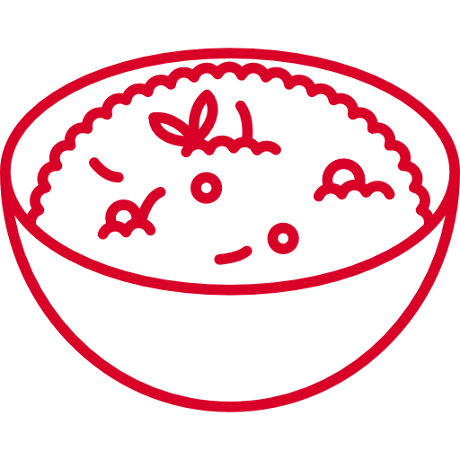

 
	
## Risotto

This is the bundle of web demos of Stone Co.'s Solutions team. In them we simulate the websites of some our customers to show how our payment solutions can integrate better into their scenarios.

### Introduction
#### Motivation
When selling, we need ways to materialize solutions to prospects. The idea behind this project is to unify them into an stable structure. This will enable us to move faster and concentrate on more value-generating activities.

#### Why the name?
**Risotto** is the one thing bachelors learn to cook - besides ramen - when they get to live by themselves. It is a quick and dirty thing, that aggregates loads of stuff. Just like this project.


### Getting Started
---

```sh
# Clone it
git clone git@github.com:victorteodoro/risotto.git
cd risotto

# Install dependencies with npm
npm i

# Install dependencies with yarn
yarn install

# Start development server
npm start

# or
yarn start
```

### Credits
Icon made by [Freepik](http://www.freepik.com) from [Flaticon](https://www.flaticon.com/) is licensed by [CC 3.0 BY](http://creativecommons.org/licenses/by/3.0/)
